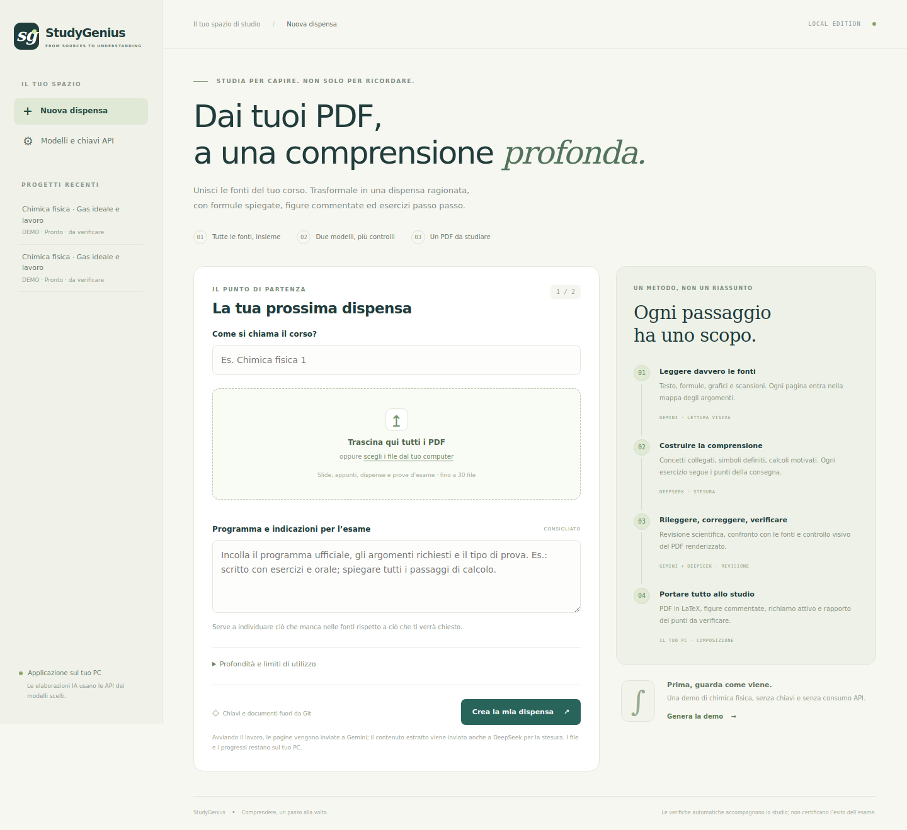

# StudyGenius · Comprendere, un passo alla volta

Un'applicazione che gira **sul tuo PC**, apre un'interfaccia in italiano nel browser e trasforma più PDF di un corso in una dispensa di studio. **Gemini legge le pagine e revisiona; DeepSeek organizza e scrive; il computer compone il PDF con LaTeX.**

L'applicazione gira localmente; i modelli vengono chiamati via Internet con i tuoi account API. Non richiede una GPU né l'esecuzione di un modello sul PC.



**Guarda il risultato:** [dispensa prodotta con Gemini e DeepSeek](examples/collaudo-live.pdf) · [rapporto della prova](docs/COLLAUDO.md) · [demo senza API](examples/demo-gas-ideale.pdf).

## Avvio su Windows

1. Installa **Python 3.12** da [python.org](https://www.python.org/downloads/windows/), selezionando **Add Python to PATH**.
2. Installa [MiKTeX](https://miktex.org/download). Apri MiKTeX Console, aggiorna i pacchetti e abilita l'installazione dei pacchetti mancanti, oppure installa quelli elencati sotto. Riavvia il terminale dopo l'installazione.
3. Scarica questa repository con **Code → Download ZIP** ed estraila in una cartella scrivibile, oppure clonala con Git.
4. Fai doppio clic su **`Avvia_StudyGenius.bat`**. Al primo avvio viene creato un ambiente Python isolato e vengono scaricate le dipendenze.
5. Il browser si apre su **http://127.0.0.1:8765**. Tieni aperta la finestra del programma.
6. Prova **Genera la demo**: produce un PDF reale, senza chiavi e senza consumare crediti API.
7. Apri **Modelli e chiavi API**, inserisci le tue chiavi, premi **Salva e verifica accesso**. Se un modello non è disponibile, scegline uno dall'elenco restituito dal tuo account.
8. Inserisci il nome del corso, carica tutti i PDF, aggiungi il programma ufficiale se disponibile e avvia la dispensa.

**Pacchetti LaTeX utilizzati:** `fontspec`, `babel` (italiano), `geometry`, `amsmath`, `amssymb`, `mathtools`, `graphicx`, `adjustbox`, `xcolor`, `tcolorbox`, `enumitem`, `fancyhdr`, `titlesec`, `microtype`, `hyperref`, `needspace`. Font preferiti: TeX Gyre Pagella e Heros; fallback: Latin Modern. Il compilatore richiesto è **XeLaTeX** o LuaLaTeX, non il solo pdfLaTeX.

Se l'avvio non trova Python o LaTeX, correggi l'installazione e riapri il programma. Non occorre reinserire i PDF già caricati.

## Avvio da terminale

```bash
git clone https://github.com/infostoreoverline-cell/study_genius_completo.git
cd study_genius_completo
python -m venv .venv
```

Windows:

```bat
.venv\Scripts\python -m pip install -r requirements.txt -e .
.venv\Scripts\python -m studygenius
```

macOS / Linux:

```bash
source .venv/bin/activate
python -m pip install -r requirements.txt -e .
python -m studygenius
```

Su Ubuntu/Debian:

```bash
sudo apt-get install texlive-xetex texlive-latex-extra texlive-fonts-recommended texlive-lang-italian fonts-texgyre
```

Su macOS installa [MacTeX](https://www.tug.org/mactex/). In alternativa, `bash avvia.sh` prepara l'ambiente Python e avvia l'app.

Comandi utili:

```bash
python -m studygenius doctor
python -m studygenius demo
python -m studygenius --port 8766 --no-browser
```

## Alternativa con Docker

Con Docker Desktop già installato:

```bash
docker compose up --build
```

Apri http://127.0.0.1:8765. Il primo build include LaTeX e può richiedere diversi minuti e spazio su disco. I dati sono nel volume Docker `studygenius-data`. `docker compose down` conserva il volume; **non aggiungere `-v`** se vuoi conservare i progetti. Il container usa un utente senza privilegi e la porta pubblicata è associata solo a `127.0.0.1`.

## Come lavora

1. **Acquisizione completa.** Verifica i PDF, scarta duplicati identici, conserva i file e indicizza tutte le pagine con identificatori stabili. Non taglia il documento a un numero di pagine nascosto.
2. **Lettura multimodale.** Ogni pagina viene inviata a Gemini come immagine, insieme al testo estratto. Funziona anche con scansioni, nei limiti della leggibilità del documento. Individua teoria, dimostrazioni, esercizi, grafici, tabelle e mappe.
3. **Percorso di studio.** DeepSeek organizza tutti gli argomenti estratti. Un controllo deterministico verifica che nessun ID sia omesso, duplicato nell'indice o inventato. I contesti grandi sono suddivisi in blocchi, senza troncamento silenzioso.
4. **Spiegazione approfondita.** Una guida condivisa allinea simboli, convenzioni e conflitti nelle fonti prima della scrittura. Ogni autore riceve l'indice completo e sviluppa il capitolo assegnato: paragrafi ragionati, ipotesi e unità, derivazioni con passaggi espliciti, esercizi con consegna e punti richiesti, risposte e controlli dimensionali. I casi creati per esercitarsi sono etichettati.
5. **Figure spiegate.** I grafici originali vengono ritagliati e riprodotti con assi, guida alla lettura, significato e limiti. Se un ritaglio è problematico, il ciclo di revisione può ripiegare sulla pagina intera. Ricostruzioni vettoriali opzionali usano solo serie numeriche dichiarate; il testo della dispensa rimane testo LaTeX. Non è un PDF fatto di SVG.
6. **Revisione e correzione.** Gemini controlla testo e immagini contro le fonti. DeepSeek corregge i problemi, fino al numero di cicli scelto. I problemi non risolti vengono segnalati e il PDF resta **da verificare**.
7. **Compilazione e controllo visivo.** Il sistema compila davvero con LaTeX, controlla errori, glifi mancanti e fuoriuscite dai margini, poi sottopone tutte le pagine renderizzate a Gemini per la verifica visiva.
8. **Consegna.** PDF selezionabile, archivio dei sorgenti LaTeX con le figure e rapporto di qualità con riferimenti alle pagine.

La metodologia completa è in [docs/METODO_DI_STUDIO.md](docs/METODO_DI_STUDIO.md), i contratti e i componenti in [docs/ARCHITETTURA.md](docs/ARCHITETTURA.md).

## Qualità: cosa viene misurato

Il conteggio di copertura significa **argomenti identificati dal lettore che sono presenti nella dispensa**, non una dimostrazione matematica che il lettore abbia riconosciuto ogni concetto della fonte. Una pagina letta non implica che ogni simbolo sia stato interpretato bene.

Le revisioni tra modelli possono sbagliare. Il programma ufficiale, le prove del docente e i punti segnalati restano necessari per valutare la preparazione all'esame. Se il programma non è fornito, il documento lo segnala. L'applicazione non promette una preparazione infallibile.

I file marcati **demo** usano contenuti prestabiliti. La demo verifica l'applicazione e il PDF, non il ragionamento dei provider. Il collaudo con risposte API simulate è separato dalla prova live documentata in [docs/COLLAUDO.md](docs/COLLAUDO.md).

## Chiavi, dati e costi

- Le chiavi inserite nell'interfaccia restano **in memoria** per impostazione predefinita. Con **Ricorda le chiavi su questo PC** vengono scritte in chiaro nel file locale `.studygenius/private-settings.json`, escluso da Git. Non usare il salvataggio su un PC condiviso.
- Puoi anche copiare `.env.example` in `.env` e compilare i campi. Non pubblicare `.env`. Le variabili d'ambiente prevalgono sui valori salvati all'avvio.
- Chiavi pubblicate in chat o in repository devono essere **revocate e sostituite**. Le chiavi fornite per il collaudo non fanno parte del codice.
- Il traffico va alle API ufficiali `generativelanguage.googleapis.com` e `api.deepseek.com`. Non vengono usati servizi di telemetria, CDN o font remoti nell'interfaccia.
- I PDF e i contenuti vengono inviati ai provider per svolgere il lavoro; considera le rispettive condizioni di trattamento dei dati. Il programma locale non è un'esecuzione offline dei modelli.
- Tutti i tentativi di generazione, compresi retry e richieste interrotte, contano nel **limite di chiamate**. I consumi confermati sono registrati in SQLite. Per timeout/interruzioni il costo effettivo può essere sconosciuto.
- La **soglia token** viene controllata prima della chiamata successiva, usando il consumo già noto: una chiamata può superarla. Non è un tetto garantito in euro. I costi correnti sono quelli dei provider.
- Al limite il lavoro si mette in pausa. Aumenta i limiti nel progetto e premi **Riprendi**; il conteggio non si azzera.
- I file locali, le immagini delle pagine e i checkpoint possono occupare spazio consistente. Esegui backup della cartella `.studygenius` ad applicazione chiusa. Nel caso Docker esegui il backup del volume.

Limiti attuali per progetto: **30 PDF, 100 MB ciascuno, 500 MB totali, 1.500 pagine**. Una dispensa di centinaia di pagine può richiedere molte chiamate e ore di elaborazione; il tempo dipende dai provider e dai cicli di revisione.

## Modelli e compatibilità

Predefiniti al momento del collaudo: `gemini-3.8-flash` e `deepseek-v4-pro`. I nomi sono modificabili. La verifica nell'interfaccia interroga gli elenchi dei modelli, ma non certifica che una generazione abbia credito o quota sufficienti.

Gli schemi complessi possono essere rifiutati da alcuni endpoint Gemini: in quel caso l'adattatore riprova in modalità JSON, fornisce il contratto nel prompt e applica comunque tutta la validazione locale. Il tentativo aggiuntivo conta nel limite di chiamate.

Riferimenti ufficiali:

- [Gemini generateContent](https://ai.google.dev/api/generate-content): immagini inline e generazione con JSON Schema.
- [Elenco modelli Gemini](https://ai.google.dev/api/models).
- [DeepSeek Chat Completions](https://api-docs.deepseek.com/api/create-chat-completion/): risposta JSON e conteggio dei token.
- [Modelli e prezzi DeepSeek](https://api-docs.deepseek.com/quick_start/pricing/).

## Sviluppo e test

```bash
python -m pip install -r requirements.txt -e '.[test]'
python -m pytest -q
python scripts/check_secrets.py
```

Il test di integrazione richiede LaTeX: usa risposte HTTP predeterminate, ma esegue realmente acquisizione, checkpoint, ripresa dopo un limite, revisione, compilazione e verifica del PDF. I test non richiedono chiavi e non consumano credito. La CI installa LaTeX ed esegue questi controlli.

Collaudo opzionale nel browser: installa `playwright==1.51.0`, esegui `python -m playwright install chromium`, poi `python scripts/ui_smoke.py`. Per la prova **a pagamento** con entrambi i provider e un PDF sintetico: configura le chiavi localmente ed esegui `python scripts/live_smoke.py --live`. Il relativo progetto limita le chiamate a 45 e la soglia a 300.000 token.

Non avviare più processi server sullo stesso archivio dati. L'applicazione è pensata per un singolo utente locale; non esporla direttamente su Internet.
