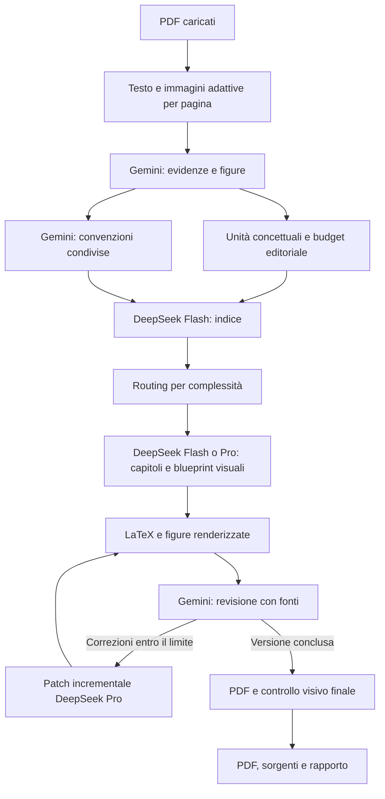

# Architettura e contratti

## Componenti

| Modulo | Responsabilità |
| --- | --- |
| `app.py` | API FastAPI, upload, configurazione privata, coda locale, download autorizzati |
| `static/` | Interfaccia italiana senza framework di build, CDN o dipendenze browser remote |
| `storage.py` | SQLite per stati, eventi e consumi; JSON atomici per i checkpoint |
| `ingest.py` | Validazione PDF, impronte SHA-256 e acquisizione parallela di tutte le pagine |
| `vision.py` | Profili adattivi per immagini multimodali e fallback ad alta fedeltà |
| `editorial.py` | Profili di output, budget deterministici, deduplicazione dei topic e selezione visuale |
| `models.py` | Contratti Pydantic per evidenze, indice, lezioni, grafici e revisioni |
| `providers.py` | API native Gemini e DeepSeek, retry, cache e conteggi persistenti |
| `prompts.py` | Brief editoriali umani e ruoli, versionati insieme al codice; i vincoli meccanici restano nei contratti |
| `pipeline.py` | Orchestrazione e controlli di copertura, revisione e produzione |
| `render.py` | Composizione LaTeX, whitelist matematica, inserimento delle figure, compilazione e controlli |
| `renderers/` | Matplotlib per grafici analitici e Graphviz per mappe, entrambi in PDF vettoriale nativo |
| `demo.py` | Campione esplicito e deterministico, distinto dalla modalità live |

## Flusso dati



## Tracciabilità

Un documento è identificato da `D001`; una pagina da `D001-P0001`; un argomento da `D001-P0001-T01`; una figura da `D001-P0001-V01`. Gli identificatori sono assegnati dall'applicazione. Il modello non sceglie percorsi sul filesystem.

L'indice deve utilizzare ciascun argomento esattamente una volta. Anche nelle sezioni della lezione ogni `topic_id` può comparire una sola volta: riferimenti ripetuti allo stesso concetto vengono riuniti in una unità e spiegati insieme. La lezione spiega ciascuna figura assegnata una volta. Gli esercizi e i grafici non possono citare argomenti esterni al capitolo. La mappa di copertura e il budget editoriale sono esportati nel rapporto.

Le figure ricostruibili di una pagina condivisa tra più capitoli sono assegnate al primo capitolo pertinente. Gemini non restituisce coordinate di ritaglio: produce una `SchedaAnaliticaGrafico` o una `SchedaMappa`, validate prima che i renderer locali generino il PDF vettoriale. La pagina sorgente completa resta disponibile al revisore; una preview PNG serve soltanto alla review e non viene inserita nella dispensa.

## Contesto e documenti lunghi

- Lettura: 1-4 pagine per richiesta, immagini incluse. Il batch usa una capacità adattiva: scansioni e testo minuto pesano il doppio delle pagine digitali. Rendering locale a profilo adattivo; una segnalazione esplicita di illeggibilità produce una rilettura isolata a risoluzione maggiore.
- Pianificazione: inventari di massimo 200 unità concettuali e 100.000 caratteri; il numero obiettivo di capitoli viene ripartito tra i blocchi.
- Stesura: il numero di argomenti per capitolo dipende dal profilo (fino a 32 nel riassunto); 90.000 caratteri restano il limite di contesto. I gruppi troppo estesi vengono suddivisi preservando tutti gli ID.
- Budget: parole, sezioni, paragrafi, esercizi, richiami, mappe e grafici sono validati per capitolo; anche la somma globale deve rientrare nel massimo del profilo.
- Coerenza: estrazione delle convenzioni da tutte le evidenze in blocchi di 100 argomenti / 80.000 caratteri; sintesi delle convenzioni e dei conflitti, condivisa con autore e revisore insieme all'indice. Un cambio della guida invalida i capitoli salvati con una guida diversa.
- Revisione delle fonti: immagini in gruppi di massimo 12, con il contesto testuale del capitolo; gruppi indipendenti eseguiti con concorrenza limitata.
- Revisione dell'impaginazione: geometria e font di tutte le pagine controllati localmente; tavole panoramiche numerate coprono il documento completo e vengono inviate fino a quattro per richiesta; pagine con figure, testo piccolo o confini strutturali vengono inviate anche a piena risoluzione.
- Rilievi finali: se la revisione visiva aggiunge problemi, l'elenco iniziale nel PDF viene aggiornato e ricompilato. Il rapporto distingue l'impaginazione sottoposta al modello da quella finale; non attribuisce una seconda revisione visiva alla nuova pagina dei rilievi.
- Confronto globale con il programma: indice e obiettivi completi, fino a 180.000 caratteri. Oltre tale limite viene segnalata la necessità di verifica manuale; non si finge che il confronto sia stato eseguito.

La pianificazione per grandi inventari privilegia l'ordine delle fonti. La deduplicazione globale dei titoli è conservativa e non sostituisce un embedding o un knowledge graph completo; le ripetizioni riconosciute restano comunque tracciate con tutti gli ID sorgente.

## Errori, costi e ripresa

Gli stati sono `ready`, `queued`, `running`, `paused`, `failed`, `needs_review`, `completed`. Un solo lavoro viene eseguito alla volta. Alla chiusura o al riavvio, i lavori interrotti diventano riprendibili.

Ogni richiesta è prenotata in una transazione SQLite **prima** dell'invio. I retry contano e i limiti sopravvivono al riavvio. La soglia dei token usa soltanto consumi ricevuti dal provider e non può garantire un costo massimo monetario. I timeout possono avere consumi sconosciuti.

Le risposte valide vengono memorizzate prima di applicare una pausa richiesta durante la chiamata. La chiave di cache include versione del protocollo, provider, modello, prompt, schema e impronte delle immagini. Esistono una cache per progetto e una cache condivisa locale, entrambe rivalidate. I prefissi comuni precedono il contenuto variabile per favorire le cache native dei provider. Una risposta troncata non viene accettata come documento valido. I tentativi di riparazione del JSON e di aumento dell'output sono limitati.

La finestra di lavoro dei capitoli è distinta dai limiti API: con i valori predefiniti possono avanzare fino a quattro capitoli tra scrittura, compilazione e review, ma i semafori continuano ad ammettere al massimo due richieste Gemini e due DeepSeek. La compatibilità degli endpoint strutturati viene ricordata localmente per versione e modello; il fallback conserva la validazione completa e non viene riprovato inutilmente a ogni nuovo progetto.

I checkpoint di lettura, le bozze, le patch, le revisioni intermedie e i capitoli completati sono riutilizzati quando si riprende. Ogni bozza viene rivalidata contro argomenti, figure e mappe prima dell'uso. Le revisioni scientifiche modificano il minimo sottoalbero JSON necessario e vengono poi rivalidate come lezioni complete. Per rigenerare anche i capitoli già completati con un diverso modello o protocollo bisogna creare un nuovo progetto.

## LaTeX e dati non fidati

L'autore restituisce contenuti strutturati, non un preambolo LaTeX eseguibile. Il testo viene escapato, la matematica passa una whitelist di comandi e ambienti, la compilazione disabilita la shell e limita gli accessi TeX. Le chiavi non vengono passate nell'ambiente del compilatore. I grafici accettano solo serie numeriche finite, formule descrittive e parametri validati; nessuna formula viene valutata con `eval`. Le mappe accettano nodi e archi con ID validati e Graphviz riceve un DOT composto localmente, mai codice del modello. Il processo `dot` è avviato senza shell e con timeout. Non viene eseguito codice Python, SVG, DOT o LaTeX generato dal modello.

Queste difese riducono i rischi ma **non sono una sandbox OS per file PDF ostili**: il parser PyMuPDF e il motore TeX restano software nativi. Per materiale non fidato è disponibile il container senza privilegi. Non esporre il server a utenti remoti.

Il server controlla Host, Origin e un token anti-CSRF per le mutazioni. Non abilita CORS. Le chiavi sono mascherate nei contratti di configurazione, mai restituite via API. I download usano una whitelist e non consentono percorsi arbitrari.

## Artefatti

Il progetto locale conserva:

```text
.studygenius/
  studygenius.sqlite3
  private-settings.json       # solo con salvataggio esplicito delle chiavi
  provider-capabilities.json  # compatibilità API, nessuna chiave o risposta
  jobs/<id>/
    inputs/                   # PDF originali
    inputs.json               # nomi, pagine, impronte
    pages/                    # immagini delle pagine
    pages.json
    evidence/                 # checkpoint di lettura
    evidence.json
    outline.json
    course-guide.json         # convenzioni, simboli e conflitti condivisi
    cache/                    # risposte validate, senza chiavi
    chapters/                 # versioni, revisioni e anteprime
    visuals/                  # PDF vettoriali ricostruiti e preview di revisione
    layout/                   # pagine del PDF renderizzato
    output/
      dispensa.pdf
      dispensa.tex
      assets/                 # PNG originali; SVG/PDF/PNG delle ricostruzioni
      contenuti.json
      qualita.json
      qualita.md
      sorgenti.zip
```

Il pacchetto sorgenti include contenuti, evidenze e figure necessari a ispezionare e ricompilare la dispensa. Non include le chiavi, il database dei consumi né i PDF originali completi. Questi ultimi rimangono nella cartella del progetto e sono già posseduti dall'utente.

## Limiti operativi dichiarati

Non sono implementati: collaborazione tra utenti, app desktop nativa, scheduler cloud, sincronizzazione remota dei progetti, prezzi aggiornati automaticamente, embedding/vector database, ricerca bibliografica esterna autonoma, nuove mappe concettuali generate da zero e pubblicazione di contenuti. Il prodotto è concentrato sul flusso locale PDF → dispensa verificabile.
