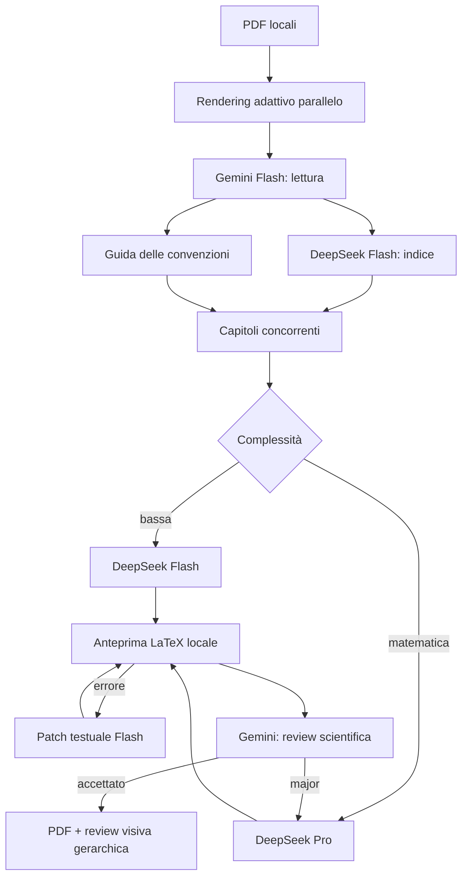

# Refactoring prestazioni e costi · StudyGenius 1.1

## Obiettivo misurabile

Il refactoring riduce pixel inviati, contesti ripetuti, chiamate di revisione e tempi morti senza rimuovere i controlli di copertura scientifica. La qualità resta protetta dagli stessi contratti Pydantic, dalla compilazione reale, dalla revisione incrociata e da fallback ad alta fedeltà. “Zero regressioni” è trattato come un gate di test e revisione, non come una promessa assoluta sulla risposta probabilistica dei modelli.

## Interventi implementati

| Area | Prima | StudyGenius 1.1 | Protezione della qualità |
| --- | --- | --- | --- |
| Immagini delle pagine | Sempre 150 DPI, JPEG 90 | Profili locali a 108/132/160/180 DPI; limite di lato e byte; JPEG progressivo | Scansioni e testo sotto 7 pt ricevono più dettaglio; un dubbio di leggibilità attiva una sola rilettura a 190 DPI |
| Output strutturato | Schema Gemini; schema DeepSeek ripetuto nel prompt JSON | Schema nativo su Gemini e DeepSeek Responses API | Pydantic rivalida sempre; fallback limitato a JSON mode per endpoint meno recenti |
| Cache | Cache del singolo progetto | Cache del progetto, cache validata condivisa locale e cache di prefisso dei provider | La chiave include modello, prompt, schema e hash delle immagini; una risposta viene riusata solo dopo validazione completa |
| Routing | DeepSeek Pro per indice e ogni capitolo | DeepSeek Flash per indice e riparazioni; Pro per derivazioni/esercizi/formule; Flash per capitoli semplici con escalation a Pro se la review fallisce | Nessun capitolo viene accettato sotto 90/100 o con issue major/blocker |
| LaTeX | Una compilazione fallita portava a rigenerare il capitolo intero | Estrazione locale del primo errore e sostituzioni testuali minime con DeepSeek Flash | Percorsi limitati a campi stringa esistenti, digest della bozza, nuova validazione e nuova compilazione |
| Build PDF | File ausiliari e PDF aggiornati nella cartella pubblica durante la compilazione | Directory pulita univoca, fino a quattro passaggi con arresto a convergenza, verifica PDF e sostituzione atomica | Un'interruzione non può lasciare un PDF troncato; indice e riferimenti si stabilizzano prima della consegna |
| Parallelismo | Lettura, indice, capitoli e review in sequenza | `asyncio` con semafori per provider; rendering PDF locale con pool limitato | Ordine ricostruito deterministicamente; SQLite prenota ogni chiamata prima dell'invio |
| Controllo finale | Quattro pagine ad alta risoluzione per chiamata Gemini | Geometria/font controllati localmente su ogni pagina, panoramiche di tutte le pagine, dettaglio pieno delle pagine a rischio | Copertura completa conservata; figure, testo piccolo, inizi capitolo e pagine estreme sono sempre nel controllo dettagliato |
| Ripresa | Capitoli finali e risposte in cache | Anche bozze e review intermedie già pagate vengono riprese direttamente | Bozza, topic e figure vengono rivalidati prima del riuso |

I prefissi comuni del corso precedono i dati variabili del capitolo. Questo aumenta le probabilità di cache hit: Gemini 2.5+ abilita la cache implicita automaticamente e DeepSeek applica la cache su disco ai prefissi coincidenti. StudyGenius registra ora anche i token di input dichiarati come cache hit dai provider. La cache esplicita Gemini non viene creata per i soli prompt di sistema, perché i prompt correnti sono sotto la soglia minima dichiarata e una cache a pagamento sarebbe controproducente.

## Benchmark locale riproducibile

Comando:

```bash
python scripts/benchmark_optimizations.py examples/carnot/carnot-fonte.pdf \
  --output examples/carnot/carnot-ottimizzazione-preprocessing.json
```

Sul PDF sintetico Carnot di tre pagine, nello stesso ambiente:

| Metrica | Pipeline fissa | Preprocessing adattivo | Variazione |
| --- | ---: | ---: | ---: |
| Pixel complessivi | 6.530.142 | 5.058.144 | −22,54% |
| Byte JPEG complessivi | 594.486 | 379.528 | −36,16% |
| Serializzazione dello schema `Lesson` | 5.647 caratteri | 5.103 caratteri | −9,63% |

Le tre pagine Carnot sono tutte classificate `technical` a 132 DPI; grafici, etichette e tabella restano leggibili nell'ispezione visiva. Pixel e byte non equivalgono direttamente ai token fatturati: il provider applica il proprio preprocessore. Il file JSON conserva misure e profili pagina per pagina.

Quando è disponibile una dispensa finale, lo stesso script accetta `--final-pdf` e confronta anche il numero di richieste previste dalla vecchia revisione a blocchi di quattro con il nuovo controllo gerarchico. Sulla dispensa Carnot di 59 pagine il piano passa da 15 a 7 richieste visive (−53,33%): sette panoramiche coprono tutte le pagine e undici pagine a rischio restano disponibili a piena risoluzione. È una riduzione di chiamate prevista dal piano, non una misura monetaria del provider.

## Flusso ottimizzato



## Configurazione

I valori predefiniti sono conservativi: due richieste concorrenti per provider. Si possono modificare con `GEMINI_CONCURRENCY` e `DEEPSEEK_CONCURRENCY`, da 1 a 8. Aumentare la concorrenza riduce il tempo solo se quota e rete lo consentono; non riduce i token.

`DEEPSEEK_FAST_MODEL` seleziona il modello economico, mentre `DEEPSEEK_MODEL` resta il modello di ragionamento. `DEEPSEEK_REASONING_EFFORT` accetta `low`, `high` o `max`. L'interfaccia espone i due modelli e lo sforzo; la concorrenza resta una scelta di installazione.

Riferimenti API verificati durante il refactoring: [Gemini context caching](https://ai.google.dev/gemini-api/docs/generate-content/caching), [Gemini Generate Content](https://ai.google.dev/api/generate-content), [DeepSeek Responses API](https://api-docs.deepseek.com/api/create-response/), [DeepSeek context caching](https://api-docs.deepseek.com/guides/kv_cache/).
